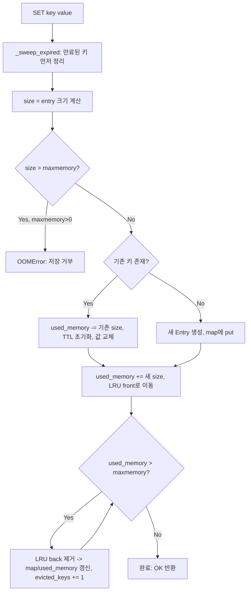
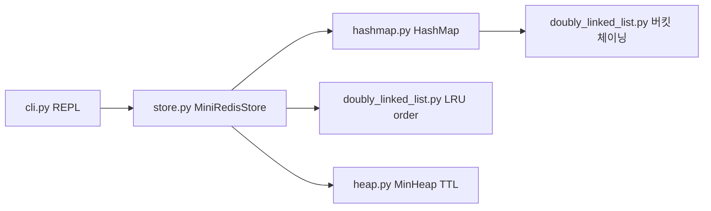

# Mini Redis 구술 평가 대비 문서

과제 목표(3번)에서 요구하는 네 가지를 내 코드를 근거로 직접 설명해본다.
Redis가 왜 빠른지 "in-memory라서"라고 답하면 반은 맞고 반은 틀렸다. 진짜 이유는
자료구조 선택이 전부 O(1)/O(log n)이 되도록 짜여 있기 때문이다. 이 프로젝트에서
그 이유를 손으로 다시 만들어봤다.

---

## 1. 해시맵의 해시 함수와 충돌 해결(체이닝)

`mini_redis/hashmap.py`의 `_hash_key`:

```python
def _hash_key(key, capacity):
    h = 5381
    for ch in key:
        h = ((h * 33) + ord(ch)) & 0xFFFFFFFF
    return h % capacity
```

djb2 계열 다항 해시다. 문자 하나하나를 `h = h*33 + ord(ch)` 규칙으로 누적한다.
33을 곱하는 이유는 홀수이면서 2의 거듭제곱과 거리가 먼 상수를 곱하면 비트가
고르게 섞이기 때문이다(경험적으로 검증된 상수, djb2가 오래 살아남은 이유이기도
하다). `& 0xFFFFFFFF`로 32비트 오버플로를 잘라내고, 마지막에 `% capacity`로
버킷 인덱스 범위로 축소한다.

문제는 서로 다른 키가 같은 인덱스로 매핑되는 충돌이다. `user:1`과 `user:2`가
같은 버킷에 떨어질 수 있다. 이걸 체이닝으로 푼다:

```python
self._buckets = [DoublyLinkedList() for _ in range(capacity)]
```

버킷 하나가 곧 연결 리스트 하나다. 충돌이 나면 그냥 같은 버킷의 리스트 뒤에
새 `_Pair(key, value)`를 붙인다(`insert_back`). `put`/`get`/`remove` 모두
"해당 인덱스 버킷을 순회하며 key가 같은 노드를 찾는다"는 동일한 패턴을 쓴다.
버킷 하나에 항목이 몰리지만 않으면 이 순회는 사실상 상수 시간이다.

버킷이 붐비지 않게 하는 장치가 로드 팩터다:

```python
if self._size / self._capacity > 0.75:
    self._resize(self._capacity * 2)
```

항목 수가 버킷 수의 75%를 넘는 순간 버킷을 2배로 늘리고 기존 `_Pair` 전부를
새 용량 기준으로 다시 해싱해서 옮긴다(`_resize`). `test_hashmap_chaining_and_resize`에서
50개 키를 capacity=4로 시작한 맵에 넣고도 전부 정상 조회되는 걸로 이 과정을
검증했다 — 리사이즈가 안 됐다면 버킷 하나에 12개 이상이 몰려서 사실상 O(n)
연결 리스트 탐색이 됐을 것이다.

---

## 2. 이중 연결 리스트 + 해시맵으로 O(1) LRU가 되는 이유

LRU("가장 오래 안 쓴 키부터 지운다")를 구현하려면 두 가지가 동시에 빨라야 한다.

1. 특정 키를 "방금 썼다"고 표시하고 순서상 맨 앞으로 옮기기
2. "가장 오래 안 쓴 키"(맨 뒤)를 즉시 꺼내기

배열만으로 하면 1번이 O(n)이다(중간 항목을 앞으로 옮기려면 밀어야 한다).
`store.py`의 해법은 각 `Entry`가 **자기 자신의 연결 리스트 노드를 직접 들고
있는 것**이다.

```python
class Entry:
    __slots__ = ("value", "size", "lru_node", "expire_at", "ttl_version")
```

```python
def _touch_lru(self, entry, key):
    if entry.lru_node is None:
        entry.lru_node = self._lru.insert_front(key)
    else:
        self._lru.move_to_front(entry.lru_node)
```

`GET`이 성공하면 `_touch_lru`가 호출된다. 해시맵으로 `entry`를 O(1)에 찾고,
그 `entry.lru_node`는 이미 연결 리스트 안의 정확한 위치를 가리키는 포인터이므로
"어디 있는지 찾는" 과정 자체가 없다. `move_to_front`는 앞뒤 포인터만 갈아 끼우는
연산이라 O(1)이다:

```python
def move_to_front(self, node):
    node.prev.next = node.next
    node.next.prev = node.prev
    self._link_after(self._head, node)
```

제거할 때(`_evict_if_needed`)는 `remove_back()`으로 리스트의 맨 뒤 — 가장
오래 안 쓴 키 — 를 O(1)에 꺼낸다. 즉 "해시맵이 위치를 알려주고, 연결 리스트가
그 위치에서 O(1)로 움직인다"는 조합이 핵심이다. 배열이었다면 해시맵으로 인덱스를
알아내도 그 인덱스를 옮기는 비용이 O(n)이었을 것이다.

`test_lru_eviction_matches_requirements_example`이 이 흐름 전체를 검증한다:
`maxmemory=30`에서 `user:1`(11B), `user:2`(9B), `user:3`(13B)를 넣으면 33B가
되어 초과하고, 가장 오래 안 쓴 `user:1`이 지워지며 `used_memory`가 22로 떨어진다.

---

## 3. 힙이 TTL 관리에 적합한 이유

TTL 관리의 핵심 질문은 "지금 이 순간 만료된 키가 있는가? 있다면 어떤 키인가?"다.
모든 키를 순회하며 `expire_at`을 비교하면 O(n)이다. 힙은 "가장 작은 값(=가장 빨리
만료될 시각)"을 항상 루트에 유지하므로, 루트만 확인하면 O(1)에 "지금 만료된 게
있는지"를 알 수 있고, 실제로 꺼내는 데는 O(log n)이 든다.

```python
def _sweep_expired(self, now):
    while self._ttl_heap.size() > 0 and self._ttl_heap.peek()[0] <= now:
        expire_at, key, version = self._ttl_heap.pop()
        entry = self._get_entry(key)
        if entry is not None and entry.expire_at == expire_at and entry.ttl_version == version:
            self._purge(key, entry)
```

모든 키 명령(`GET`, `SET`, `EXISTS`, ...) 시작 시 이 sweep을 한 번 돌린다. 힙
루트가 `now`보다 크면 즉시 멈춘다 — 힙 성질상 루트보다 작은 값은 트리 안에
존재할 수 없으므로, 이후 항목도 전부 아직 안 만료됐다는 게 보장된다.

한 가지 함정이 있다. 힙은 "이 키의 예약된 만료를 취소"하는 연산(임의 위치 삭제)을
지원하지 않는다. `SET`으로 같은 키를 덮어쓰면 TTL이 초기화되어야 하는데, 옛
힙 항목이 그대로 남아 있으면 나중에 튀어나와 엉뚱하게 삭제할 위험이 있다. 그래서
`ttl_version`을 뒀다:

```python
entry.ttl_version += 1
self._ttl_heap.push((entry.expire_at, key, entry.ttl_version))
```

힙에서 항목을 꺼낼 때 `entry.expire_at == expire_at and entry.ttl_version == version`이
안 맞으면 "이미 무효화된 예약"이라 보고 그냥 버린다. 힙 자체를 건드리지 않고
"버전 불일치로 무시"하는 lazy deletion으로 정확성을 지키는 방식이다.

---

## 4. 메모리 제한 + LRU 제거 전체 흐름

`SET`이 호출됐을 때 실제로 벌어지는 일을 순서대로 짚는다.



`used_memory`는 값 하나하나를 계산하지 않고 **증분으로만** 갱신한다(삽입 시
`+= size`, 덮어쓸 때 `-= 기존 size` 후 `+= 새 size`, 삭제/제거 시 `-= size`).
매번 전체를 다시 합산하면 O(n)이 되어 SET 자체가 느려지기 때문이다.

`_evict_if_needed`가 `while`로 도는 이유는 새 항목 하나가 여러 옛 항목의 크기를
합친 것보다 클 수 있어서다(예: `user:3`이 13B라 20B였던 상태에서 33B가 되면,
`user:1` 하나(11B)를 지워야 22B로 떨어진다 — 실제로 1개만 지워지는지, 2개
필요한지는 상황마다 다르므로 조건을 만족할 때까지 반복한다).

---

## 코드 구조 한눈에



연결 리스트 구현체 하나를 "LRU 순서 추적"과 "해시맵 버킷 체이닝" 두 곳에
재사용했다. 서로 다른 문제처럼 보이지만 둘 다 "포인터로 연결된 노드 집합에서
O(1)로 넣고 빼기"라는 같은 연산이 필요했기 때문이다.

## 아쉬운 점 / 다음에 한다면

- `ttl_version`으로 무효화하는 대신, 힙 항목이 자신을 가리키는 `Entry`를 직접
  들고 있게 하면 버전 비교 없이도 무효화를 표현할 수 있다(다만 그러면 힙 항목이
  Entry를 참조하고 Entry는 참조하지 않아도 되므로 순환 참조는 피할 수 있다 —
  지금 구조가 더 단순해서 그대로 뒀다).
- `INFO memory`에 `evicted_keys`는 있지만 "몇 개가 TTL로 자연 만료됐는지"는
  집계하지 않는다. 요구사항에 없어서 안 넣었는데, 실제 Redis라면 `expired_keys`도
  같이 노출한다.
